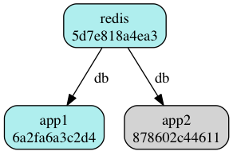
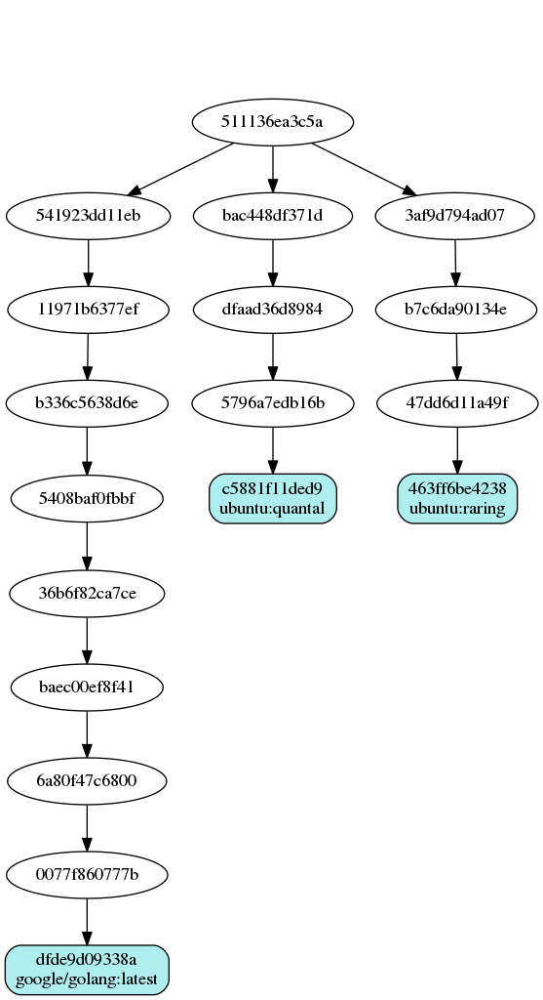

Follow [@dockviz](https://twitter.com/dockviz) for updates.

# dockviz: Visualizing Docker Data

This command takes Docker image and container information and presents in
different ways, to help you understand what's going on inside the system.

# Quick Start

1. Install dockviz.  Either:
  * Download the [latest release](https://github.com/justone/dockviz/releases).
  * Set up an alias to run it from the (5.8 MB) docker image: 

  ```
  alias dockviz="docker run -it --rm -v /var/run/docker.sock:/var/run/docker.sock nate/dockviz"
  ```
2. Visualize images by running `dockviz images -t`, which has similar output to `docker images -t`.

Image can be visualized as [Graphviz](http://www.graphviz.org), or as a tree or short summary in the terminal.  Only Graphviz output has been implemented for containers.

# Output Examples

## Containers

Currently, containers are visualized with labelled lines for links.  Containers that aren't running are greyed out.

```
$ dockviz containers -d | dot -Tpng -o containers.png
```



## Images

Image info is visualized with lines indicating parent images:

```
$ dockviz images -d | dot -Tpng -o images.png
OR
$ dockviz images --dot | dot -Tpng -o images.png
```



```
$ dockviz images -d -l | dot -Tpng -o images.png
OR
$ dockviz images --dot --only-labelled | dot -Tpng -o images.png
```


Or in short form:

```
$ dockviz images -s
nate/mongodb: latest
redis: latest
ubuntu: 12.04, precise, 12.10, quantal, 13.04, raring
```

Or as a tree in the terminal:

```
$ dockviz images -t
└─511136ea3c5a Virtual Size: 0.0 B
  ├─f10ebce2c0e1 Virtual Size: 103.7 MB
  │ └─82cdea7ab5b5 Virtual Size: 103.9 MB
  │   └─5dbd9cb5a02f Virtual Size: 103.9 MB
  │     └─74fe38d11401 Virtual Size: 209.6 MB Tags: ubuntu:12.04, ubuntu:precise
  ├─ef519c9ee91a Virtual Size: 100.9 MB
  │ └─07302703becc Virtual Size: 101.2 MB
  │   └─cf8dc907452c Virtual Size: 101.2 MB
  │     └─a7cf8ae4e998 Virtual Size: 171.3 MB Tags: ubuntu:12.10, ubuntu:quantal
  │       │─e18d8001204e Virtual Size: 171.3 MB
  │       │ └─d0525208a46c Virtual Size: 171.3 MB
  │       │   └─59dac4bae93b Virtual Size: 242.5 MB
  │       │     └─89541b3b35f2 Virtual Size: 511.8 MB
  │       │       └─7dac4e98548e Virtual Size: 511.8 MB
  │       │         └─341d0cc3fac8 Virtual Size: 511.8 MB
  │       │           └─2f96171d2098 Virtual Size: 511.8 MB
  │       │             └─67b8b7262a67 Virtual Size: 513.7 MB
  │       │               └─0fe9a2bc50fe Virtual Size: 513.7 MB
  │       │                 └─8c32832f07ba Virtual Size: 513.7 MB
  │       │                   └─cc4e1358bc80 Virtual Size: 513.7 MB
  │       │                     └─5c0d04fba9df Virtual Size: 513.7 MB Tags: nate/mongodb:latest
  │       └─398d592f2009 Virtual Size: 242.2 MB
  │         └─0cd8e7f50270 Virtual Size: 243.6 MB
  │           └─594b6f8e6f92 Virtual Size: 243.6 MB
  │             └─f832a63e87a4 Virtual Size: 243.6 MB Tags: redis:latest
  └─02dae1c13f51 Virtual Size: 98.3 MB
    └─e7206bfc66aa Virtual Size: 98.5 MB
      └─cb12405ee8fa Virtual Size: 98.5 MB
        └─316b678ddf48 Virtual Size: 169.4 MB Tags: ubuntu:13.04, ubuntu:raring
```

Only showing labelled images:

```
$ dockviz images -t -l
└─511136ea3c5a Virtual Size: 0.0 B
  ├─f10ebce2c0e1 Virtual Size: 103.7 MB
  │ └─74fe38d11401 Virtual Size: 209.6 MB Tags: ubuntu:12.04, ubuntu:precise
  ├─ef519c9ee91a Virtual Size: 100.9 MB
  │ └─a7cf8ae4e998 Virtual Size: 171.3 MB Tags: ubuntu:12.10, ubuntu:quantal
  │   ├─5c0d04fba9df Virtual Size: 513.7 MB Tags: nate/mongodb:latest
  │   └─f832a63e87a4 Virtual Size: 243.6 MB Tags: redis:latest
  └─02dae1c13f51 Virtual Size: 98.3 MB
    └─316b678ddf48 Virtual Size: 169.4 MB Tags: ubuntu:13.04, ubuntu:raring
```

Showing incremental size rather than cumulative:

```
$ dockviz images -t -i
└─511136ea3c5a Virtual Size: 0.0 B
  ├─f10ebce2c0e1 Virtual Size: 103.7 MB
  │ └─82cdea7ab5b5 Virtual Size: 255.5 KB
  │   └─5dbd9cb5a02f Virtual Size: 1.9 KB
  │     └─74fe38d11401 Virtual Size: 105.7 MB Tags: ubuntu:12.04, ubuntu:precise
  ├─ef519c9ee91a Virtual Size: 100.9 MB
  │ └─07302703becc Virtual Size: 251.0 KB
  │   └─cf8dc907452c Virtual Size: 1.9 KB
  │     └─a7cf8ae4e998 Virtual Size: 70.1 MB Tags: ubuntu:12.10, ubuntu:quantal
  │       ├─e18d8001204e Virtual Size: 29.4 KB
  │       │ └─d0525208a46c Virtual Size: 71.0 B
  │       │   └─59dac4bae93b Virtual Size: 71.2 MB
  │       │     └─89541b3b35f2 Virtual Size: 269.3 MB
  │       │       └─7dac4e98548e Virtual Size: 0.0 B
  │       │         └─341d0cc3fac8 Virtual Size: 0.0 B
  │       │           └─2f96171d2098 Virtual Size: 0.0 B
  │       │             └─67b8b7262a67 Virtual Size: 1.9 MB
  │       │               └─0fe9a2bc50fe Virtual Size: 656.0 B
  │       │                 └─8c32832f07ba Virtual Size: 383.0 B
  │       │                   └─cc4e1358bc80 Virtual Size: 0.0 B
  │       │                     └─5c0d04fba9df Virtual Size: 0.0 B Tags: nate/mongodb:latest
  │       └─398d592f2009 Virtual Size: 70.9 MB
  │         └─0cd8e7f50270 Virtual Size: 1.4 MB
  │           └─594b6f8e6f92 Virtual Size: 0.0 B
  │             └─f832a63e87a4 Virtual Size: 0.0 B Tags: redis:latest
  └─02dae1c13f51 Virtual Size: 98.3 MB
    └─e7206bfc66aa Virtual Size: 190.0 KB
      └─cb12405ee8fa Virtual Size: 1.9 KB
        └─316b678ddf48 Virtual Size: 70.8 MB Tags: ubuntu:13.04, ubuntu:raring
```

Showing non-human numbers, for precision:

```
$ dockviz images -t -i -c
└─511136ea3c5a Size: 0
  ├─f10ebce2c0e1 Size: 103675325
  │ └─82cdea7ab5b5 Size: 255455
  │   └─5dbd9cb5a02f Size: 1919
  │     └─74fe38d11401 Size: 105667193 Tags: ubuntu:12.04, ubuntu:precise
  ├─ef519c9ee91a Size: 100930679
  │ └─07302703becc Size: 250998
  │   └─cf8dc907452c Size: 1919
  │     └─a7cf8ae4e998 Size: 70094270 Tags: ubuntu:12.10, ubuntu:quantal
  │       ├─e18d8001204e Size: 29352
  │       │ └─d0525208a46c Size: 71
  │       │   └─59dac4bae93b Size: 71150930
  │       │     └─89541b3b35f2 Size: 269335966
  │       │       └─7dac4e98548e Size: 0
  │       │         └─341d0cc3fac8 Size: 0
  │       │           └─2f96171d2098 Size: 0
  │       │             └─67b8b7262a67 Size: 1866379
  │       │               └─0fe9a2bc50fe Size: 656
  │       │                 └─8c32832f07ba Size: 383
  │       │                   └─cc4e1358bc80 Size: 0
  │       │                     └─5c0d04fba9df Size: 0 Tags: nate/mongodb:latest
  │       └─398d592f2009 Size: 70917743
  │         └─0cd8e7f50270 Size: 1418392
  │           └─594b6f8e6f92 Size: 0
  │             └─f832a63e87a4 Size: 0 Tags: redis:latest
  └─02dae1c13f51 Size: 98348330
    └─e7206bfc66aa Size: 190007
      └─cb12405ee8fa Size: 1903
        └─316b678ddf48 Size: 70822908 Tags: ubuntu:13.04, ubuntu:raring
```

# Running

Dockviz supports connecting to the Docker daemon directly.  It defaults to `unix:///var/run/docker.sock`, but respects the following as well:

* The `DOCKER_HOST`, `DOCKER_CERT_PATH`, and `DOCKER_TLS_VERIFY` environment variables, as set up by [boot2docker](http://boot2docker.io/) or [docker-machine](https://docs.docker.com/machine/).
* Command line arguments (e.g. `--tlscacert`), like those that Docker itself supports.

Dockviz also supports receiving Docker image or container json data on standard input.

```
$ curl -s http://localhost:4243/images/json?all=1 | dockviz images --tree
$ curl -s http://localhost:4243/containers/json?all=1 | dockviz containers --dot | dot -Tpng -o containers.png
$ echo -e "GET /images/json?all=1 HTTP/1.0\r\n" | nc -U /var/run/docker.sock | sed '1,/^[[:space:]]*$/d' | dockviz images --tree
$ echo -e "GET /containers/json?all=1 HTTP/1.0\r\n" | nc -U /var/run/docker.sock | sed '1,/^[[:space:]]*$/d' | dockviz containers --dot | dot -Tpng -o containers.png
$ echo -e "GET /images/json?all=1 HTTP/1.0\r\n" | nc -U /var/run/docker.sock | sed '1,/^[[:space:]]*$/d' | docker run -i nate/dockviz images --tree
$ echo -e "GET /containers/json?all=1 HTTP/1.0\r\n" | nc -U /var/run/docker.sock | sed '1,/^[[:space:]]*$/d' | docker run -i nate/dockviz containers --dot | dot -Tpng -o containers.png
```

Note: GNU netcat doesn't support `-U` (UNIX socket) flag, so OpenBSD variant can be used.

# Binaries

See the [releases](https://github.com/justone/dockviz/releases) area for binaries.

# Build

```bash
go get ./...
go build
```
